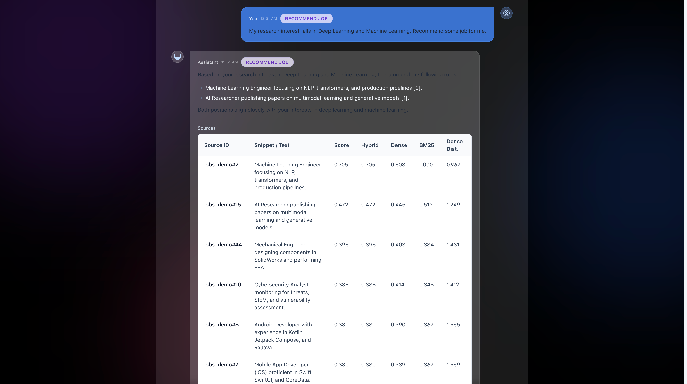
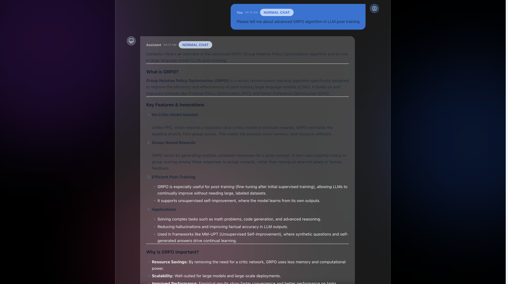
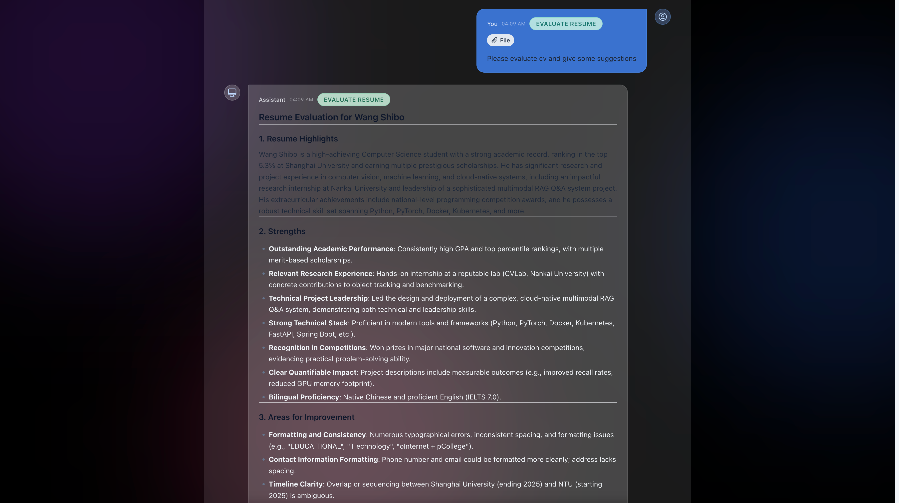
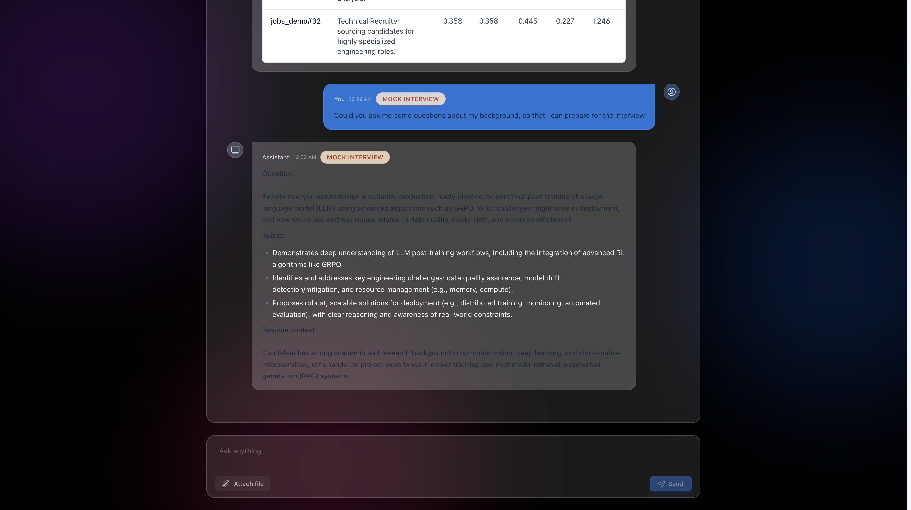

## RAG QA Demo Frontend

基于 React + Vite 的单会话问答界面，为 RAG 系统提供现代、动效丰富的前端外壳。页面使用玻璃拟态 + 渐变云团背景、Framer Motion 动画、粘性顶栏状态灯，突出对话体验，同时兼顾检索结果展示。

### 功能亮点
- 动态界面：全屏渐变光晕与玻璃拟态卡片，输入区与消息气泡均有平滑动效与悬浮态。
- 健康状态与历史：启动时调用 `/health`、`/history?limit=20`，支持错误提示与加载态，自动滚动到底部。
- 消息气泡：意图徽章、时间戳、文件标识；助手回复支持 Markdown 渲染与来源表格（含混合/稠密/BM25 分数）。
- 发送面板：文本 + PDF/DOCX/TXT 可选附件，Enter 发送，必填校验与 API 错误提示；`POST /generate` 以 `multipart/form-data` 发送，禁用 `web_search`/`return_stream`/`persist_documents`。
- 可配置后端：默认请求 `http://localhost:8000`，可在 `frontend/.env` 中设置 `VITE_API_BASE_URL` 以切换目标。

### 目录结构
- `frontend/src/App.tsx`：主界面逻辑、状态管理与动画布局。
- `frontend/src/api.ts`：HTTP 客户端与错误封装。
- `frontend/src/parse.ts`：提取文本并检测 `<document>...</document>` 片段。
- `frontend/src/components/*`：气泡、徽章、文件标识、来源表格、错误提示等 UI 组件。

### 本地运行
```bash
cd frontend
npm install
npm run dev
```
开发服务器默认 `http://localhost:5173`，代理 `/api/*` 至 `http://localhost:8000`。

### 构建 & 代码检查
```bash
npm run build
npm run lint
```

### 界面预览
现代黑色背景、渐变光晕和玻璃卡片的交互效果（取自根目录 demo 截图）：





